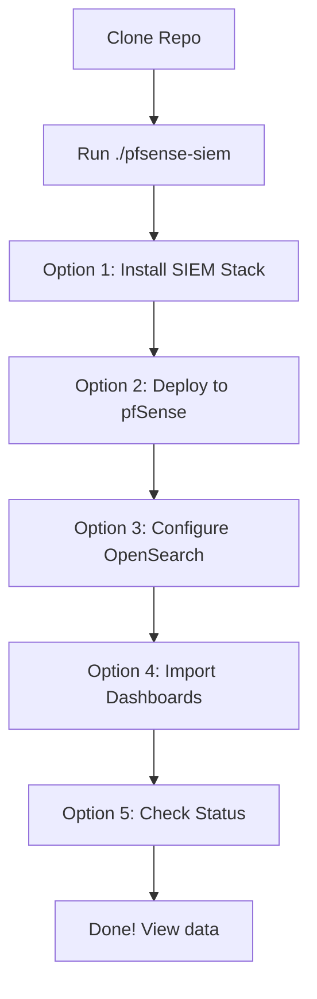
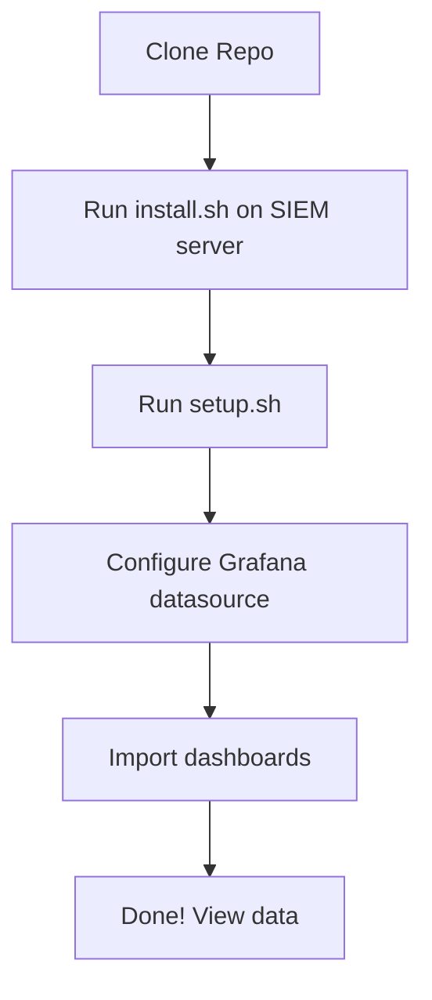

# Project Organization & Structure

> **Repository Layout Guide** — File organization and navigation for the pfSense Knowledge Base

This repository has evolved from a simple Grafana dashboard into a comprehensive pfSense knowledge base covering security, monitoring, automation, and operations.

## Quick Navigation

**New to the project?** → Start with [README.md](README.md)  
**Want quick deployment?** → Follow [QUICK_START.md](QUICK_START.md)  
**Need specific docs?** → Browse [docs/DOCUMENTATION_INDEX.md](docs/DOCUMENTATION_INDEX.md)  
**Something not working?** → Check [docs/TROUBLESHOOTING.md](docs/TROUBLESHOOTING.md)  
**Want to contribute?** → Read [CONTRIBUTING.md](CONTRIBUTING.md)

## Essential Files

| File | Purpose | When to Use |
|------|---------|-------------|
| `pfsense-siem` ⭐ | Management console | **START HERE** - Interactive menu for everything |
| `install.sh` | Installs SIEM stack | Run FIRST on Ubuntu/Debian server |
| `setup.sh` | Automated deployment | Run SECOND to deploy to pfSense |
| `dashboards/pfsense_pfblockerng_system.json` | pfSense system dashboard | Import into Grafana (InfluxDB) |
| `dashboards/Suricata IDS_IPS Dashboard.json` | WAN security dashboard | Import into Grafana (OpenSearch) |
| `dashboards/Suricata_Per_Interface.json` | Per-interface LAN dashboard | Import into Grafana (OpenSearch) |
| `config/opensearch-index-template.json` | Index template | Auto-applied by install.sh |
| `scripts/forward-suricata-eve-python.py` | Forwarder code | Auto-deployed by setup.sh |

## Directory Structure

```
pfsense_grafana/
├── 🎮 Management Console
│   └── pfsense-siem                        ★★★ INTERACTIVE MENU FOR EVERYTHING
│
├── 📄 Core Documentation
│   ├── README.md                           ← START HERE
│   ├── QUICK_START.md                      ← Fast 15-min setup
│   ├── ORGANIZATION.md                     ← This file
│   └── LICENSE
│
├── 📊 dashboards/
│   ├── pfsense_pfblockerng_system.json     ★ pfSense system & pfBlockerNG
│   ├── Suricata IDS_IPS Dashboard.json     ★ WAN-side security monitoring
│   ├── Suricata_Per_Interface.json         ★ Per-interface LAN monitoring
│   └── archive/                            Old versions (reference only)
│
├── 🔧 scripts/
│   ├── forward-suricata-eve-python.py      ★ Multi-interface forwarder
│   ├── check-forwarder-status.sh           Status monitoring
│   ├── check-system-health.sh              System diagnostics
│   ├── restart-services.sh                 Service management
│   ├── verify-suricata-data.sh             Data validation
│   ├── configure-retention-policy.sh       Index lifecycle
│   ├── check-and-restart-logstash.sh       Logstash maintenance
│   ├── README.md                           Script documentation
│   └── archive/                            Deprecated scripts
│
├── ⚙️ config/
│   ├── logstash-suricata.conf              Logstash pipeline
│   └── opensearch-index-template.json      Index template (geo_point)
│
├── 📚 docs/
│   ├── INSTALL_SIEM_STACK.md               SIEM installation guide
│   ├── INSTALL_PFSENSE_FORWARDER.md        Forwarder deployment
│   ├── INSTALL_DASHBOARD.md                Dashboard configuration
│   ├── CONFIGURATION.md                    Advanced settings
│   ├── TROUBLESHOOTING.md                  Problem solving
│   ├── GEOIP_SETUP.md                      GeoIP database setup
│   ├── MULTI_INTERFACE_RETENTION.md        Multi-WAN & retention
│   └── archive/                            Historical docs
│
├── 🔌 plugins/
│   ├── telegraf_pfifgw.php                 Gateway monitoring
│   ├── telegraf_temperature.sh             Temperature stats
│   ├── telegraf_unbound.sh                 DNS resolver stats
│   ├── telegraf_unbound_lite.sh            Lightweight DNS stats
│   ├── README.md                           Plugin documentation
│   └── Old/                                Deprecated plugins
│
├── 🖼️ media/
│   ├── Grafana-pfSense.png                         pfSense system dashboard
│   ├── Suricata IDS_IPS WAN Dashboard.png          WAN security dashboard
│   ├── Suricata Per-Interface Dashboard.png        Per-interface dashboard
│   └── streamelements.png                          Donation icon
│
├── 🧪 tests/
│   ├── test-multi-interface.sh             Multi-interface testing
│   └── test-panel-compatibility.sh         Dashboard panel testing
│
└── 🚀 Installation Scripts
    ├── install.sh                          ★ SIEM stack installer
    ├── deploy-pfsense-forwarder.sh         ★ Forwarder deployer
    └── install_plugins.sh                  Telegraf plugin installer
```

## Setup Workflow

### Option 1: Management Console (Recommended)



**Single command:** `./pfsense-siem`

### Option 2: Manual Commands



1. **SIEM Server**: `sudo ./install.sh`
2. **Deployment**: `./setup.sh`
3. **Grafana**: Add OpenSearch datasource
4. **Dashboard**: Import JSON file

## Documentation Map

| Document | Audience | Content |
|----------|----------|---------|
| README.md | Everyone | Project overview, features, quick start |
| QUICK_START.md | Beginners | Step-by-step 15-minute setup |
| docs/INSTALL_SIEM_STACK.md | Admins | Detailed OpenSearch/Logstash/Grafana install |
| docs/INSTALL_PFSENSE_FORWARDER.md | Admins | Manual forwarder deployment |
| docs/CONFIGURATION.md | Advanced | Tuning, performance, customization |
| docs/TROUBLESHOOTING.md | Support | Common issues and solutions |

## Key Features

### Multi-Interface Forwarder
- Automatically detects ALL Suricata instances
- Threaded monitoring of multiple eve.json files
- No manual configuration for multiple WANs

### GeoIP Enrichment
- City-level location data
- Proper geo_point mapping for Grafana geomap
- Uses MaxMind GeoLite2-City database

### Optimized Dashboard
- No hardcoded datasource (user-selectable)
- Clean pie charts (labels on hover only)
- 54 fields excluded from alert table
- Proper geohash aggregation for map

## Archive Policy

Moved to `archive/` when superseded or deprecated, but kept for reference.
