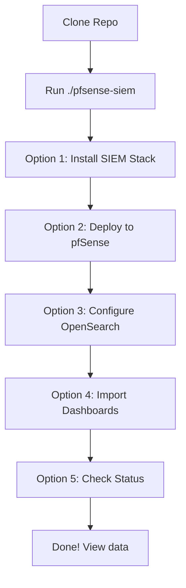
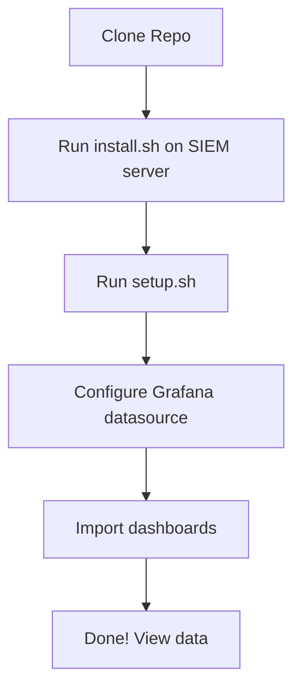

# Project Organization & Structure

> **Repository Layout Guide** — File organization and navigation for the pfSense SIEM Stack

This repository has evolved from a simple Grafana dashboard into a full pfSense SIEM toolkit covering security, monitoring, automation, and operations.

## Quick Navigation

**New to the project?** → Start with [README.md](README.md)  
**Want quick deployment?** → Follow [QUICK_START.md](QUICK_START.md)  
**Need specific docs?** → Browse [docs/DOCUMENTATION_INDEX.md](docs/DOCUMENTATION_INDEX.md)  
**Something not working?** → Check [docs/troubleshooting/TROUBLESHOOTING.md](docs/troubleshooting/TROUBLESHOOTING.md)  
**Want to contribute?** → Read [CONTRIBUTING.md](CONTRIBUTING.md)

## Essential Files

| File | Purpose | When to Use |
|------|---------|-------------|
| `pfsense-siem` ⭐ | Management console | **START HERE** - Interactive menu for everything |
| `install.sh` | Installs SIEM stack | Run FIRST on Ubuntu/Debian server |
| `setup.sh` | Automated deployment | Run SECOND to deploy to pfSense |
| `dashboards/pfsense_pfblockerng_system.json` | pfSense system & pfBlockerNG dashboard | Import into Grafana (InfluxDB + OpenSearch-pfBlockerNG) |
| `dashboards/Suricata_IDS_IPS.json` | WAN security dashboard | Import into Grafana (OpenSearch) |
| `dashboards/Suricata_Per_Interface.json` | Per-interface LAN dashboard | Import into Grafana (OpenSearch) |
| `config/opensearch-index-template.json` | Suricata index template | Auto-applied by install.sh |
| `config/opensearch-pfblockerng-template.json` | pfBlockerNG index template | Auto-applied by install.sh |
| `scripts/forward-suricata-eve.py` | Forwarder code | Auto-deployed by setup.sh |

## Directory Structure

```
pfsense-siem-stack/
├── 🎮 Management Console
│   └── pfsense-siem                        ★★★ INTERACTIVE MENU FOR EVERYTHING
│
├── 📄 Core Documentation
│   ├── README.md                           ← START HERE
│   ├── QUICK_START.md                      ← Fast 15-min setup
│   ├── ROADMAP.md                          ← Project plan
│   ├── ORGANIZATION.md                     ← This file
│   └── LICENSE
│
├── 📊 dashboards/
│   ├── pfsense_pfblockerng_system.json     ★ pfSense system & pfBlockerNG
│   ├── Suricata_IDS_IPS.json               ★ WAN-side security monitoring
│   ├── Suricata_Per_Interface.json         ★ Per-interface LAN monitoring
│   ├── suricata_ids_ips_active.json        Current production Suricata export
│   ├── prometheus_stats.json               Prometheus internals
│   ├── docker_container_monitoring.json    Container metrics (cAdvisor)
│   ├── windows_exporter.json               Windows host metrics
│   ├── datasources_reference.json          Datasource UID reference
│   └── wazuh/                              Wazuh dashboards + deploy README
│
├── 🔧 scripts/
│   ├── forward-suricata-eve.py             ★ Multi-interface forwarder
│   ├── status.sh                           Comprehensive status check
│   ├── diagnose-and-repair.sh              Guided diagnostics/repair
│   ├── restart-services.sh                 Service management
│   ├── configure-retention-policy.sh       Index lifecycle (ISM)
│   ├── install-opensearch-config.sh        Index templates
│   ├── deploy-wazuh-dashboards.py          Wazuh dashboard deployment
│   ├── setup_forwarder_monitoring.sh       Watchdog/cron installer
│   ├── suricata-forwarder-watchdog.sh      Forwarder watchdog
│   ├── apply-suricata-drop-rules.sh        SID drop-rule management
│   ├── preflight.sh                        Pre-install/deploy sanity checks
│   ├── check-doc-links.py                  Docs link checker (CI)
│   └── README.md                           Script documentation
│
├── ⚙️ config/
│   ├── logstash-suricata.conf              Logstash pipeline (flat EVE fields)
│   ├── opensearch-index-template.json      Suricata index template (geo_point)
│   ├── opensearch-pfblockerng-template.json pfBlockerNG index template (keyword)
│   └── sid/                                Suricata SID tuning lists
│
├── 📚 docs/
│   ├── DOCUMENTATION_INDEX.md              ★ Documentation hub (start here)
│   ├── ARCHIVE.md                          Where superseded material went (git history)
│   ├── install/                            SIEM server, forwarder, dashboards, GeoIP
│   │   ├── INSTALL_SIEM_STACK.md
│   │   ├── INSTALL_PFSENSE_FORWARDER.md
│   │   ├── INSTALL_DASHBOARD.md
│   │   ├── GEOIP_SETUP.md
│   │   ├── NEW_USER_CHECKLIST.md
│   │   └── HARDWARE_REQUIREMENTS.md
│   ├── pfsense/                            Suricata/pfBlockerNG/Telegraf tuning
│   │   ├── SURICATA_CONFIGURATION.md
│   │   ├── SURICATA_OPTIMIZATION_GUIDE.md
│   │   ├── PFBLOCKERNG_OPTIMIZATION.md
│   │   ├── LAN_MONITORING.md
│   │   ├── TRAFFIC_SHAPING_GUIDE.md
│   │   ├── TELEGRAF_PFBLOCKER_SETUP.md
│   │   ├── TELEGRAF_RESTART_PROCEDURE.md
│   │   ├── MAC_VENDOR_LOOKUP_SETUP.md
│   │   └── crowdsec-phase1.md
│   ├── operations/                         Monitoring, watchdogs, retention
│   │   ├── MANAGEMENT_CONSOLE.md
│   │   ├── SURICATA_FORWARDER_MONITORING.md
│   │   ├── FORWARDER_MONITORING_QUICK_REF.md
│   │   ├── MULTI_INTERFACE_RETENTION.md
│   │   └── SETUP_FILTERLOG_MONITORING_CRON.md
│   ├── troubleshooting/                    Symptom → fix guides
│   │   ├── TROUBLESHOOTING.md
│   │   ├── DASHBOARD_NO_DATA_FIX.md
│   │   ├── OPENSEARCH_AUTO_CREATE.md
│   │   ├── LOG_ROTATION_FIX.md
│   │   ├── PFSENSE_FILTERLOG_ROTATION_FIX.md
│   │   ├── PF_INFORMATION_PANEL_ISSUE.md
│   │   └── TELEGRAF_INTERFACE_FIXES.md
│   ├── reference/                          Configuration/scripts reference, architecture
│   │   ├── CONFIGURATION.md
│   │   ├── SCRIPTS_REFERENCE.md
│   │   ├── architecture.mmd
│   │   └── architecture.png
│   └── siem/                               SIEM backend comparison & integrations
│       ├── COMPARISON.md
│       ├── graylog/README.md
│       └── wazuh/README.md
│
├── 🔌 plugins/
│   ├── telegraf_pfifgw.php                 Gateway monitoring
│   ├── telegraf_arp_mac_vendor.php         MAC vendor lookup (ARP)
│   ├── telegraf_temperature.sh             Temperature stats
│   ├── telegraf_unbound.sh                 DNS resolver stats
│   ├── telegraf_unbound_lite.sh            Lightweight DNS stats
│   └── README.md                           Plugin documentation
│
├── 🧪 tests/
│   ├── test-multi-interface.sh             Multi-interface testing
│   ├── test-panel-compatibility.sh         Dashboard panel testing
│   └── python/test_forwarder.py            Forwarder unit tests (pytest)
│
└── 🚀 Installation Scripts
    ├── install.sh                          ★ SIEM stack installer (server side)
    ├── setup.sh                            ★ Deployment to pfSense
    └── install_plugins.sh                  Telegraf plugin installer
```

## Setup Workflow

### Option 1: Management Console (Recommended)


```mermaid
graph TD
    A[Clone Repo] --> B[Run ./pfsense-siem]
    B --> C[Option 1: Install SIEM Stack]
    C --> D[Option 2: Deploy to pfSense]
    D --> E[Option 3: Configure OpenSearch]
    E --> F[Option 4: Import Dashboards]
    F --> G[Option 5: Check Status]
    G --> H[Done! View data]
```

**Single command:** `./pfsense-siem`

### Option 2: Manual Commands


```mermaid
graph TD
    A[Clone Repo] --> B[Run install.sh on SIEM server]
    B --> C[Run setup.sh]
    C --> D[Configure Grafana datasource]
    D --> E[Import dashboards]
    E --> F[Done! View data]
```

1. **SIEM Server**: `sudo ./install.sh`
2. **Deployment**: `./setup.sh`
3. **Grafana**: Add OpenSearch datasource
4. **Dashboard**: Import JSON file

## Documentation Map

| Document | Audience | Content |
|----------|----------|---------|
| README.md | Everyone | Project overview, features, quick start |
| QUICK_START.md | Beginners | Step-by-step 15-minute setup |
| docs/install/INSTALL_SIEM_STACK.md | Admins | Detailed OpenSearch/Logstash/Grafana install |
| docs/install/INSTALL_PFSENSE_FORWARDER.md | Admins | Manual forwarder deployment |
| docs/reference/CONFIGURATION.md | Advanced | Tuning, performance, customization |
| docs/troubleshooting/TROUBLESHOOTING.md | Support | Common issues and solutions |

## Key Features

### Multi-Interface Forwarder
- Automatically detects ALL Suricata instances
- Threaded monitoring of multiple eve.json files
- No manual configuration for multiple WANs

### GeoIP Enrichment
- City-level location data
- Proper geo_point mapping for Grafana geomap
- Uses MaxMind GeoLite2-City database

### Optimized Dashboard
- No hardcoded datasource (user-selectable)
- Clean pie charts (labels on hover only)
- 54 fields excluded from alert table
- Proper geohash aggregation for map

## Archive Policy

Superseded material is deleted from the working tree and preserved in git history.
See [docs/ARCHIVE.md](docs/ARCHIVE.md) for the last commit that contains the old
`docs/archive/`, `scripts/archive/`, `dashboards/archive/`, and `plugins/Old/` trees,
along with recovery instructions.
