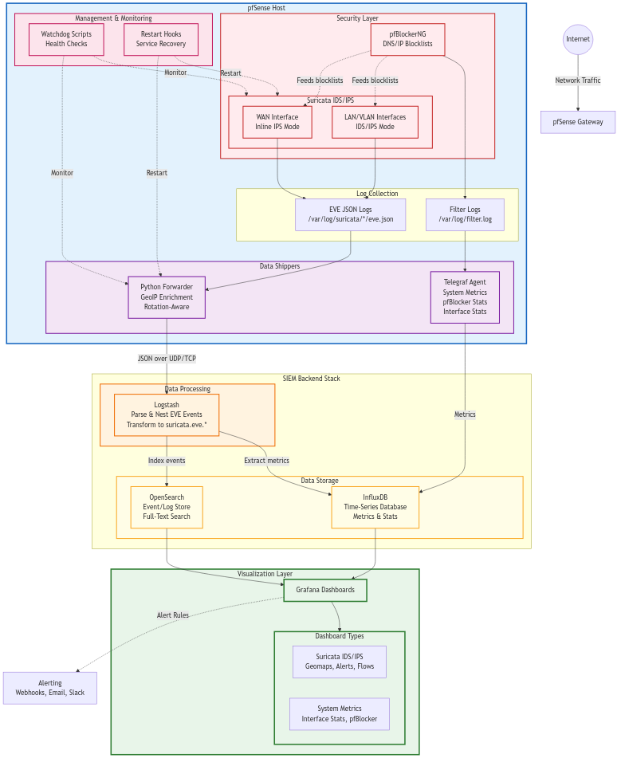

# pfSense SIEM Stack

> **Complete SIEM infrastructure for pfSense firewalls** — From basic IDS/IPS monitoring to enterprise-grade threat detection with OpenSearch, Graylog, and Wazuh integration options.

[](LICENSE)
[](https://www.pfsense.org/)
[](https://suricata.io/)
[]()

> 🎯 **Multi-SIEM Support**: Choose your SIEM backend — OpenSearch (current ✅), Graylog (planned 📝), Wazuh (planned 📝) — with unified pfSense integration.

> ⚠️ **Work in Progress**: The logging and SIEM components are actively being developed and refined. OpenSearch implementation is production-ready. Graylog and Wazuh support planned based on community contributions. Core functionality is stable, but documentation and automation are continuously improving. Contributions and feedback welcome!

---

## 📖 Overview

What started as a simple Grafana dashboard tweak evolved into a **comprehensive pfSense SIEM infrastructure project**. This repository captures lessons learned from deploying and operating enterprise-grade pfSense security monitoring, with support for multiple SIEM backends to fit your needs.

> **⚠️ SCOPE NOTICE**: This project focuses on **pfSense-based security and monitoring**. For UniFi equipment (switches, APs, controllers), use [UniFi Poller](https://github.com/unpoller/unpoller) instead - it's purpose-built for UniFi telemetry and integrates excellently with Grafana + InfluxDB.

### 🎯 Current Implementation (OpenSearch - Production Ready ✅)

- **Full SIEM Stack**: OpenSearch for event storage, Logstash for parsing/enrichment, InfluxDB for time-series metrics
- **Comprehensive IDS/IPS Monitoring**: Real-time Suricata alerts with GeoIP mapping, signature tracking, and attack visualization  
- **East-West Traffic Detection**: Internal network monitoring to detect lateral movement and insider threats
- **Resilient Data Pipeline**: Rotation-aware forwarders, watchdogs, restart hooks, and automated recovery
- **Production-Ready**: Optimized for dual-WAN inline IPS deployments with per-VLAN policy customization

### 🔮 Future SIEM Backends (Planned)

- **Graylog** 📝 - Easier setup, better web UI, excellent alerting ([see roadmap](docs/siem/graylog/README.md))
- **Wazuh** 📝 - EDR capabilities, compliance reporting, active response ([see roadmap](docs/siem/wazuh/README.md))
- **[Compare All Options](docs/siem/COMPARISON.md)** - Feature matrix and decision guide

### 📚 Knowledge Base Coverage

- **Security Hardening**: IDS/IPS configuration, blocklist optimization, signature management
- **Network Monitoring**: Multi-WAN setups, VLAN segmentation, interface tracking
- **Automation**: Log forwarding, watchdog monitoring, automated recovery
- **Performance Tuning**: Resource optimization, retention policies, query performance
- **Troubleshooting**: Common issues, debugging techniques, validation procedures
- **Deployment Guides**: Step-by-step installation, configuration templates, best practices


**📍 Quick Links**: [SIEM Comparison](docs/siem/COMPARISON.md) | [Hardware Requirements](docs/HARDWARE_REQUIREMENTS.md) ⭐ | [Project Status](#-project-status) | [Roadmap](ROADMAP.md) | [Documentation Index](docs/DOCUMENTATION_INDEX.md) | [Contributing](CONTRIBUTING.md)

---


*pfSense System and pfBlockerNG monitoring dashboard*


*WAN-side Suricata IDS/IPS monitoring with attack sources, signatures, and geographic visualization*


*Per-Interface Suricata monitoring - LAN/VLAN monitoring with dynamic interface sections*

---

## �️ Architecture



### Data Flow

1. **pfSense** runs Suricata on multiple interfaces (WAN inline IPS, VLAN IDS)
2. **Forwarder** (`forward-suricata-eve.py`) tails eve.json logs, enriches with GeoIP, handles rotation
3. **Logstash** receives events via UDP, parses/nests under `suricata.eve.*`, forwards to storage
4. **OpenSearch** indexes events for search and aggregation (geomap, dashboards)
5. **InfluxDB** stores time-series metrics for rates/counters (optional but recommended)
6. **Grafana** visualizes everything with dashboards, alerts, and geomaps
7. **Watchdogs** monitor the pipeline and restart components on failure

### Key Components

| Component | Purpose | Location |
|-----------|---------|----------|
| **Suricata** | IDS/IPS engine | pfSense (per-interface) |
| **PfBlockerNG** | Upstream blocklists | pfSense |
| **Forwarder** | Log shipping + GeoIP | pfSense → SIEM |
| **Logstash** | Parsing & enrichment | SIEM server |
| **OpenSearch** | Event storage | SIEM server |
| **InfluxDB** | Time-series DB | SIEM server |
| **Grafana** | Visualization | SIEM server |
| **Watchdogs** | Pipeline monitoring | pfSense + SIEM |

---

---

## 📊 Project Status

### ✅ Production Ready
- **Suricata Multi-Interface Monitoring** - Stable, tested on 15 instances (2 WAN + 13 VLAN)
- **Log Forwarder** - Inode-aware rotation handling, GeoIP enrichment, watchdog monitoring
- **OpenSearch/Logstash Pipeline** - Nested format, index templates, retention policies
- **WAN Security Dashboard** - Attack visualization, signature tracking, geographic mapping
- **PfBlockerNG Integration** - Blocklist optimization, DNSBL whitelisting
- **Automated Installation** - One-command SIEM stack deployment

### 🚧 Active Development (Functional but Evolving)
- **Documentation** - Continuously improving guides, adding troubleshooting scenarios
- **SID Management** - 219 optimized rules, suppress.conf refinement (testing in production)
- **LAN Monitoring Dashboard** - East-west traffic panels (planned)
- **Automation Scripts** - Additional watchdogs, health checks, recovery procedures
- **Performance Tuning** - Index optimization, query performance, resource usage

### 📝 Planned Features
- **Snort Integration** - Currently Suricata-focused, Snort support coming
- **Multi-Firewall Support** - Central monitoring for multiple pfSense instances
- **Advanced Analytics** - Machine learning for anomaly detection
- **Configuration UI** - Web interface for easier setup
- **Mobile Dashboard** - Grafana mobile optimization


## ✨ Features

### 🔥 IDS/IPS Monitoring (✅ Stable)
- **Real-time alerts** from Suricata with signature details and severity
- **GeoIP visualization** with city-level accuracy on interactive world maps
- **Multi-interface support** monitors all Suricata instances (WAN, VLANs, lagg)
- **Event analytics** by type, protocol, severity, category, and application
- **Attack tracking**: Top signatures, source countries, HTTP hosts, JA3 fingerprints
- **SID optimization**: 219 tuned signatures for reduced false positives

### 🌐 Network Intelligence (✅ Stable)
- **Dual-WAN inline IPS** with Snort + Emerging Threats on both uplinks
- **East-West detection** for lateral movement across VLANs (🚧 dashboard pending)
- **Per-VLAN policies**: Heavy monitoring on IoT, lighter on trusted VLANs
- **PfBlockerNG integration** for upstream threat filtering

### 🛠️ Reliability & Operations (✅ Stable)
- **Log rotation handling**: Inode-aware forwarder survives Suricata rotations
- **Watchdogs**: Auto-restart forwarder and Suricata on failure
- **Restart hooks**: Ensure proper startup after pfSense upgrades
- **Debug logging**: Comprehensive troubleshooting with `/var/log/suricata_forwarder_debug.log`
- **Automated setup**: One-command deployment scripts for entire stack

### � Dashboards & Alerts
- **WAN monitoring**: Attack sources, signatures, protocols, top talkers
- **LAN monitoring**: Per-interface dashboard with dynamic VLAN sections (✅ production ready)
- **Interface distribution**: Traffic breakdown by interface/VLAN
- **Alerting**: Grafana alerts + webhook integrations (🚧 refining rules)

---

## 🚀 Quick Start

### Prerequisites

> **🚨 CRITICAL HARDWARE WARNING**: 
> 
> **DO NOT USE RASPBERRY PI WITH SD CARDS OR SIMILAR SETUPS FOR LOGGING!**
> 
> High-frequency log writes will **destroy SD cards within weeks**. At minimum, use a SATA SSD with USB 3.0 adapter. For production logging/SIEM, invest in proper hardware to avoid data loss and constant rebuilds.

**SIEM Server** (Ubuntu/Debian 22.04+ or similar):
- **CPU**: Dual-core minimum (quad-core recommended for Logstash processing)
  - AMD/Intel with SMT/Hyper-Threading strongly recommended
- **RAM**: **16GB minimum, 32GB recommended** for full logging stack
  - OpenSearch: 8GB+ heap
  - Logstash: 2-4GB heap
  - InfluxDB: 2-4GB (recommended for time-series metrics)
  - Grafana: 1-2GB
  - System overhead: 2-4GB
- **Storage**: 
  - **100GB+ SSD minimum** (NVMe preferred for write performance)
  - Consider 500GB-1TB for 30+ day retention with moderate traffic
  - **NO SD CARDS** - Use proper SSDs or you'll regret it
- **Network**: Gigabit ethernet minimum
- **OS**: Ubuntu Server 24.04 LTS recommended (tested configuration)
- **Access**: Root/sudo access, static IP

**Production Reference**: Purism Librem Mini (Intel Core i7-10510U, 32GB RAM, 2TB NVMe) running Ubuntu Server 24.04 LTS handles home lab with significant headroom.

**pfSense Firewall**:
- pfSense 2.7+ (tested on 2.8.1)
- **For PfBlockerNG only**: 4-8GB RAM sufficient (even with many blocklists)
- **For Suricata IDS/IPS**:
  - **CPU**: Quad-core minimum (more cores = more throughput)
    - Intel Atom C3758 (8-core) handles 15 Suricata instances at 25-35% average load
    - **Expect CPU spikes to 100% for 3-5 minutes during rule reloads**
  - **RAM**: 8-16GB for multi-interface deployments
  - **Stream Memory**: Increase to **1073741824 bytes (1GB)** per interface (default 256MB causes crashes on multicore systems)
    - Configure in: Services → Suricata → Interface → Stream tab
- Suricata package installed and configured
- SSH enabled with key-based auth
- Python 3.11+ available

### Installation (3 Commands)

```bash
# 1. Clone repository
git clone https://github.com/ChiefGyk3D/pfsense_grafana.git
cd pfsense_grafana

# 2. Install SIEM stack (OpenSearch, Logstash, Grafana)
sudo ./install.sh

# 3. Configure environment and deploy to pfSense
cp config.env.example config.env
nano config.env  # Set SIEM_HOST and PFSENSE_HOST
./setup.sh       # Automated deployment
```

**That's it!** The setup script:
- ✅ Configures OpenSearch index templates
- ✅ Deploys forwarder to pfSense with GeoIP enrichment
- ✅ Installs watchdogs for automatic recovery
- ✅ Verifies data flow from pfSense → Logstash → OpenSearch

### Import Dashboards

1. Open Grafana: `http://<siem-server>:3000` (admin/admin)
2. Go to **Dashboards** → **Import**
3. Upload dashboards (import all three):
   - **`dashboards/pfsense_pfblockerng_system.json`** - pfSense system metrics and pfBlockerNG stats
   - **`dashboards/Suricata IDS_IPS Dashboard.json`** - WAN-side security monitoring
   - **`dashboards/Suricata_Per_Interface.json`** - Per-interface LAN/VLAN monitoring
4. Select your datasource (InfluxDB for pfSense, OpenSearch for Suricata)
5. Click **Import**

---

## 📚 Documentation

### Getting Started
- **[Quick Start Guide](QUICK_START.md)** - 15-minute deployment walkthrough
- **[New User Checklist](docs/NEW_USER_CHECKLIST.md)** - Step-by-step validation
- **[Documentation Index](docs/DOCUMENTATION_INDEX.md)** - Complete guide to all docs

### Installation & Configuration
- **[SIEM Stack Installation](docs/INSTALL_SIEM_STACK.md)** - OpenSearch, Logstash, Grafana
- **[pfSense Forwarder Setup](docs/INSTALL_PFSENSE_FORWARDER.md)** - Python forwarder deployment
- **[GeoIP Configuration](docs/GEOIP_SETUP.md)** - MaxMind database setup
- **[Configuration Guide](docs/CONFIGURATION.md)** - All `config.env` options

### Optimization & Tuning
- **[Suricata Optimization](docs/SURICATA_OPTIMIZATION_GUIDE.md)** ⭐ **ESSENTIAL**
  - Rule selection strategies
  - Performance tuning (inline IPS vs IDS)
  - Multi-interface configuration
  - Testing and validation
- **[PfBlockerNG Setup](docs/PFBLOCKERNG_OPTIMIZATION.md)** - Blocklist strategies
- **[Retention Policies](docs/MULTI_INTERFACE_RETENTION.md)** - Index lifecycle management

### Troubleshooting
- **[Troubleshooting Guide](docs/TROUBLESHOOTING.md)** - Common issues and fixes
- **[Dashboard "No Data" Fix](docs/DASHBOARD_NO_DATA_FIX.md)** - Datasource and field issues
- **[Log Rotation Fix](docs/LOG_ROTATION_FIX.md)** - Forwarder stuck on old files
- **[Forwarder Monitoring](docs/FORWARDER_MONITORING_QUICK_REF.md)** - Health checks

---

## 🔧 Advanced Topics

### Custom Deployment Scenarios

**Inline IPS on WAN + IDS on VLANs:**
```bash
# WAN interfaces: ix0, ix1 (inline IPS with Snort ET)
# VLANs: lagg1.10, lagg1.14, lagg1.22, etc. (IDS with ET)
# IoT VLANs: Heavy monitoring
# NAS/trusted VLANs: Light monitoring
```

See [Suricata Optimization Guide](docs/SURICATA_OPTIMIZATION_GUIDE.md) for per-VLAN policy configuration.

**East-West Detection:**
- Monitor RFC1918 → RFC1918 flows for lateral movement
- Separate dashboard for internal traffic analysis
- Detect anomalies like SMB brute force, RDP scanning, etc.

See [LAN Monitoring Setup](docs/LAN_MONITORING.md) for configuration.

### Watchdog & Automation

**Forwarder Watchdog** (`suricata-forwarder-watchdog.sh`):
- Monitors forwarder process health
- Restarts on failure or stuck state
- Runs via cron every 5 minutes

**Restart Hooks** (`suricata-restart-hook.sh`):
- Ensures forwarder starts after Suricata upgrades
- Handles log rotation gracefully
- Integrated with pfSense Suricata package

See [scripts/README.md](scripts/README.md) for all helper scripts.

---

## 🤝 Contributing

Contributions welcome! Areas of interest:
- Additional dashboards (firewall logs, Telegraf metrics, pfBlockerNG stats)
- Performance optimizations
- Docker/container deployment
- Ansible playbooks
- Additional forwarder integrations (Zeek, Snort3, etc.)

See [CONTRIBUTING.md](CONTRIBUTING.md) for guidelines.

---

## 📝 License

Mozilla Public License 2.0 - see [LICENSE](LICENSE) for details.

---

## � Related Projects

### UniFi Network Monitoring

**This project does NOT support UniFi equipment** (switches, access points, controllers).

For UniFi monitoring with Grafana, use **[UniFi Poller](https://github.com/unpoller/unpoller)**:
- Purpose-built for UniFi telemetry collection
- Excellent Grafana dashboard integration
- Supports InfluxDB and Prometheus
- Active community and development
- **Personal recommendation**: Use with InfluxDB for networking metrics

**Why InfluxDB for UniFi Poller?**
- Better compression for time-series data (interface metrics, client counts)
- Faster queries for rate calculations
- Lower RAM usage than OpenSearch for metrics
- Proven combination for network monitoring

See: [UniFi Poller Installation](https://unpoller.com/docs/install/installation)

---

## �🙏 Acknowledgments

- **pfSense** - Rock-solid firewall platform
- **Suricata** - High-performance IDS/IPS engine with excellent multithreading
- **OpenSearch** - Powerful search and analytics
- **Grafana** - Beautiful visualization and alerting
- **MaxMind** - GeoLite2 GeoIP database (free tier)
- **Emerging Threats** - Open IDS ruleset
- **Snort/Cisco Talos** - Registered and subscriber rules
- **Abuse.ch** - Feodo Tracker and SSL Blacklist
- **UniFi Poller** - Inspiration for telemetry collection patterns
- Community contributors and testers

---

## 📞 Support

- **Issues**: [GitHub Issues](https://github.com/ChiefGyk3D/pfsense_grafana/issues)
- **Discussions**: [GitHub Discussions](https://github.com/ChiefGyk3D/pfsense_grafana/discussions)
- **Documentation**: [docs/](docs/)

---

**Built with ❤️ for the pfSense and open-source security community**

### 5. Verify Installation

Check everything is working:

```bash
./scripts/status.sh
```

This will verify:
- ✅ OpenSearch is running and configured correctly
- ✅ Logstash is listening for events
- ✅ Forwarder is running on pfSense
- ✅ Data is flowing and recent
- ✅ Watchdog is installed
- ✅ Suricata is generating events

**Green checkmarks** = everything is working!  
**Red X's** = see the error messages and suggested fixes

## 📁 Project Structure

```
pfsense_grafana/
├── 📄 Quick Start
│   ├── README.md                    ★ START HERE - Project overview & getting started
│   ├── QUICK_START.md               Fast 15-minute deployment walkthrough
│   ├── ORGANIZATION.md              File organization and directory structure
│   ├── CHANGELOG.md                 Version history and recent changes
│   └── CONTRIBUTING.md              Guidelines for contributions
│
├── 🚀 Installation & Setup
│   ├── install.sh                   ★ SIEM stack installer (OpenSearch, Logstash, Grafana)
│   ├── setup.sh                     ★ Automated configuration (one-command deployment)
│   ├── install_plugins.sh           Telegraf plugin installer
│   └── config.env.example           Configuration template
│
├── 📊 Dashboards & Visualization
│   └── dashboards/
│       ├── pfsense_pfblockerng_system.json        ★ pfSense system & pfBlockerNG dashboard
│       ├── Suricata IDS_IPS Dashboard.json        ★ WAN-side Suricata security dashboard
│       ├── Suricata_Per_Interface.json            ★ Per-interface LAN/VLAN monitoring
│       └── archive/                               Historical dashboard versions
│
├── 🔧 Scripts & Automation
│   └── scripts/
│       ├── forward-suricata-eve.py            ★ Multi-interface log forwarder (Python)
│       ├── status.sh                          ★ Comprehensive health check
│       ├── check_custom_sids.sh               Suricata SID verification tool
│       ├── restart-services.sh                Service management & recovery
│       ├── configure-retention-policy.sh      Data lifecycle management
│       ├── suricata-forwarder-watchdog.sh     Monitoring & auto-restart
│       └── README.md                          Script documentation
│
├── ⚙️ Configuration Files
│   └── config/
│       ├── logstash-suricata.conf             ★ Logstash pipeline (parsing & enrichment)
│       ├── opensearch-index-template.json     Index template with geo_point mapping
│       ├── dnsbl_whitelist.txt                PfBlockerNG whitelist
│       ├── pfblockerng_optimization.md        Blocklist configuration guide
│       └── sid/                               Suricata signature management
│           ├── disable/disablesid.conf        219 disabled SIDs (performance optimized)
│           ├── suppress/suppress.conf         2 conditional suppressions (IP-specific)
│           ├── README.md                      SID management documentation
│           └── APPLYING_CHANGES.md            Deployment guide
│
├── 📚 Documentation (🚧 Active Development)
│   └── docs/
│       ├── DOCUMENTATION_INDEX.md             ★ Master documentation index
│       ├── architecture.png                   Visual architecture diagram
│       │
│       ├── 🏗️ Installation Guides
│       │   ├── INSTALL_SIEM_STACK.md          OpenSearch/Logstash/Grafana setup
│       │   ├── INSTALL_PFSENSE_FORWARDER.md   Forwarder deployment to pfSense
│       │   ├── INSTALL_DASHBOARD.md           Grafana dashboard import
│       │   └── NEW_USER_CHECKLIST.md          Step-by-step validation
│       │
│       ├── 🔒 Security & IDS/IPS
│       │   ├── SURICATA_OPTIMIZATION_GUIDE.md ★ Rule selection & tuning
│       │   ├── PFBLOCKERNG_OPTIMIZATION.md    Blocklist configuration
│       │   ├── LAN_MONITORING.md              Internal threat detection
│       │   └── SURICATA_FORWARDER_MONITORING.md  Watchdog strategies
│       │
│       ├── ⚙️ Configuration & Tuning
│       │   ├── CONFIGURATION.md               All config.env settings
│       │   ├── GEOIP_SETUP.md                 MaxMind GeoIP database
│       │   ├── MULTI_INTERFACE_RETENTION.md   Index lifecycle policies
│       │   └── OPENSEARCH_AUTO_CREATE.md      Midnight UTC fix
│       │
│       ├── 🐛 Troubleshooting & Fixes
│       │   ├── TROUBLESHOOTING.md             ★ Common issues & solutions
│       │   ├── LOG_ROTATION_FIX.md            Inode-aware rotation handling
│       │   ├── DASHBOARD_NO_DATA_FIX.md       Data flow validation
│       │   └── TELEGRAF_INTERFACE_FIXES.md    Interface monitoring fixes
│       │
│       └── archive/                           Historical documentation
│
├── 🔌 Plugins (Optional Telegraf Metrics)
│   └── plugins/
│       ├── telegraf_pfifgw.php                Gateway status monitoring
│       ├── telegraf_temperature.sh            Temperature sensors
│       ├── telegraf_unbound.sh                DNS resolver stats
│       └── README.md                          Plugin documentation
│
├── 🖼️ Media & Assets
│   └── media/
│       ├── Grafana-pfSense.png                    pfSense system dashboard screenshot
│       ├── Suricata IDS_IPS WAN Dashboard.png     WAN dashboard screenshot
│       ├── Suricata Per-Interface Dashboard.png   Per-interface dashboard screenshot
│       └── streamelements.png                     StreamElements donation icon
│
└── 🧪 Testing & Validation
    └── tests/
        ├── test-multi-interface.sh            Multi-WAN testing
        └── test-panel-compatibility.sh        Dashboard validation
```

**🌟 Essential Files to Get Started:**
1. **[README.md](README.md)** - Project overview, architecture, features
2. **[QUICK_START.md](QUICK_START.md)** - 15-minute deployment guide
3. **[docs/DOCUMENTATION_INDEX.md](docs/DOCUMENTATION_INDEX.md)** - Find any documentation
4. **`install.sh`** - One command to install SIEM stack
5. **`setup.sh`** - One command to configure everything
6. **`scripts/status.sh`** - Verify installation and data flow

**🚧 Work in Progress:**
- SIEM logging infrastructure (functional, documentation evolving)
- SID management optimization (219 rules tuned, testing in production)
- Dashboard improvements (LAN monitoring panels planned)
- Automation enhancements (watchdogs, recovery scripts)

## 📊 Dashboard Panels

### Dashboard 1: pfSense System & pfBlockerNG

**Purpose**: System monitoring, network performance, and pfBlockerNG statistics

#### Hardware & System
- CPU usage, memory, disk I/O
- Temperature monitoring
- System uptime and load

#### Network Statistics
- Gateway RTT and packet loss
- Interface status and throughput
- Per-WAN and per-LAN traffic graphs

#### PfBlockerNG
- IP blocks (inbound/outbound)
- DNSBL blocked queries
- Top blocked sources and destinations
- Blocked traffic by country (GeoIP)

### Dashboard 2: Suricata WAN Monitoring

**Purpose**: External threat detection and WAN-side attack analysis

#### Statistics
- **Events & Alerts**: Combined counter with sparklines and color-coded thresholds
- **Event Type Distribution**: Pie chart showing alert, http, dns, tls, etc.
- **Protocol Distribution**: TCP, UDP, ICMP breakdown

#### Alerts
- **Top Alert Signatures**: Most triggered IDS rules
- **IDS Alert Logs**: Detailed table with time, signature, IPs, ports, countries
- **Alert Severity**: Critical, high, medium, low classification

#### Geographic Visualization
- **Attack Sources Map**: Interactive world map with geohash clusters
- **Top Source Countries**: Donut chart of attack origins
- **Country Statistics**: Detailed breakdown with event counts

#### HTTP Traffic Analysis
- **Top HTTP Hosts**: Most accessed domains
- **HTTP Methods**: GET, POST, etc. distribution

### Dashboard 3: Suricata Per-Interface (LAN Monitoring)

**Purpose**: Per-VLAN/LAN monitoring with dynamically repeating sections

#### Features
- **Dynamic Interface Sections**: Automatically creates monitoring section for each selected interface
- **Multi-select Variable**: Monitor one, some, or all interfaces simultaneously
- **Per-Interface Panels** (repeated for each interface):
  - Events & Alerts counter with thresholds
  - Top Alert Signatures
  - Alerts timeline graph
  - Top Source IPs
  - Top Destination IPs
  - Complete alert logs table

#### Use Cases
- **East-West Detection**: Monitor lateral movement between VLANs
- **IoT Monitoring**: Heavy monitoring on untrusted IoT VLANs
- **Internal Threats**: Detect compromised hosts and insider threats
- **RFC1918 Traffic**: Focus on internal network communication patterns

## 🔧 Configuration

### Customize Logstash Input

Edit `/etc/logstash/conf.d/suricata.conf`:

```ruby
input {
  udp {
    port => 5140
    codec => json
  }
}
```

### Adjust Data Retention

```bash
# Configure index lifecycle policy
scripts/configure-retention-policy.sh
```

Default retention: 30 days

### GeoIP Updates

The forwarder uses MaxMind GeoLite2-City database. To update:

```bash
# On pfSense, if using ntopng, it auto-updates
# Manual update:
ssh root@pfsense
fetch -o /usr/local/share/ntopng/GeoLite2-City.mmdb \
  https://github.com/PrxyHunter/GeoLite2/raw/master/GeoLite2-City.mmdb
```

## 🔍 Troubleshooting

### Quick Diagnosis

**Run the status check first:**

```bash
./scripts/status.sh
```

This will identify most common problems automatically.

### Common Issues

**1. Dashboard shows "No Data"** ⚠️ MOST COMMON
- **Symptom**: Grafana panels show "No Data" even though Suricata is running
- **Causes**: 
  - Datasource variable not resolved (`${DS_OPENSEARCH}` instead of actual datasource UID)
  - Nested field structure vs flat field queries (dashboard expecting `event_type` but data has `suricata.eve.event_type`)
  - Logstash config changed from flat to nested structure
  - Dashboard looking at wrong time range (new flat data only exists in recent timeframe)
- **Fixes**:
  1. Check datasource configuration: Dashboard must use actual UID, not `${DS_OPENSEARCH}` variable
  2. Verify field structure: `curl -s "http://localhost:9200/suricata-*/_search?size=1" | jq '.hits.hits[0]._source | keys'`
  3. If fields are nested under `suricata.eve.*`, update Logstash config to flatten OR update dashboard queries
  4. Run `./scripts/status.sh` to diagnose data flow issues
  5. Adjust time range to match when data started flowing (check index creation timestamps)

**2. Alerts not showing but other events are**
- **Symptom**: DNS, TLS, HTTP events work, but alert panels empty
- **Cause**: Forwarder only tails from EOF (end of file), missing historical alerts
- **Fix**: Wait for NEW alerts to be generated after forwarder starts
- **Why**: The forwarder uses `f.seek(0, 2)` to start at end of file, so pre-existing alerts aren't forwarded
- **Solution**: Generate test alerts or wait for real attacks to trigger rules

**3. Data structure mismatch**
- **Symptom**: Old data works but new data doesn't (or vice versa)
- **Diagnosis**: 
  ```bash
  # Check if you have both nested and flat structures
  curl -s "http://localhost:9200/_search?size=0" -H 'Content-Type: application/json' \
    -d '{"aggs":{"nested":{"filter":{"exists":{"field":"suricata.eve.event_type"}}},"flat":{"filter":{"exists":{"field":"event_type"}}}}}'
  ```
- **Fix**: 
  1. Choose flat or nested structure (flat is simpler)
  2. Update Logstash config to match
  3. Update dashboard field references to match
  4. Optional: Reindex old data to match new structure

**4. Forwarder not running**
- Run `./scripts/status.sh` to check forwarder status
- Verify: `./setup.sh` was run successfully
- Check forwarder logs: `ssh root@<pfsense-ip> 'tail -f /var/log/system.log | grep suricata'`

**5. Data stops at midnight UTC**
- **Cause**: OpenSearch auto-create disabled
- **Fix**: Run `./setup.sh` (it configures this automatically)
- **Details**: See `docs/OPENSEARCH_AUTO_CREATE.md`

**6. Multiple forwarders running**
- Kill extras: `ssh root@<pfsense-ip> 'pkill -f forward-suricata'`
- Run `./setup.sh` to start single clean instance

**7. Wrong SIEM IP configured**
- Edit `config.env` with correct SIEM IP
- Run `./setup.sh` to redeploy with new config

### Detailed Troubleshooting

- **[Dashboard "No Data" Fix](docs/DASHBOARD_NO_DATA_FIX.md)**: 🔥 Complete guide for the most common issue - panels showing "No Data"
- **[Troubleshooting Guide](docs/TROUBLESHOOTING.md)**: Comprehensive troubleshooting for all components

### Geomap Not Displaying

The geomap requires proper `geo_point` mapping. Check:

```bash
# Verify mapping
curl http://localhost:9200/suricata-*/_mapping | jq '.[] | .mappings.properties.suricata.properties.eve.properties.geoip_src.properties.location'

# Should show: {"type": "geo_point"}
```

If not, re-create the index template:

```bash
curl -X PUT "http://localhost:9200/_index_template/suricata-template" \
  -H 'Content-Type: application/json' \
  -d @config/opensearch-index-template.json
```

### Forwarder Not Monitoring All Interfaces

The forwarder should automatically detect all Suricata instances. If missing interfaces:

```bash
# Check available eve.json files
ssh root@pfsense 'ls -la /var/log/suricata/*/eve.json'

# Restart forwarder
pkill -f forward-suricata
nohup /usr/local/bin/python3.11 /usr/local/bin/forward-suricata-eve.py > /dev/null 2>&1 &
```

See [TROUBLESHOOTING.md](docs/TROUBLESHOOTING.md) for more solutions.

### pfBlocker Panels Show No Data

If the Telegraf dashboard's pfBlocker panels are empty, this is usually caused by pfSense's filterlog daemon not properly handling log rotation.

**Quick Fix:**
```bash
# Via SSH to pfSense
ssh root@pfsense
php -r 'require_once("/etc/inc/filter.inc"); filter_configure(); system_syslogd_start();'
php -r 'require_once("/usr/local/pkg/pfblockerng/pfblockerng.inc"); pfblockerng_sync_on_changes();'
```

**Prevention & Monitoring:**
See [pfSense Filterlog Rotation Fix](docs/PFSENSE_FILTERLOG_ROTATION_FIX.md) for:
- GUI configuration options
- Automated monitoring setup
- Preventive measures
- Integration with status.sh

## 📖 Documentation

### Setup Guides
- **[New User Checklist](docs/NEW_USER_CHECKLIST.md)**: 🎯 Complete step-by-step checklist for first-time setup
- **[Quick Start Guide](QUICK_START.md)**: Fast setup for experienced users
- **[SIEM Stack Installation](docs/INSTALL_SIEM_STACK.md)**: Detailed OpenSearch/Logstash/Grafana setup
- **[Forwarder Installation](docs/INSTALL_PFSENSE_FORWARDER.md)**: pfSense forwarder deployment
- **[Dashboard Import](docs/INSTALL_DASHBOARD.md)**: Dashboard configuration and customization

### Configuration
- **[Suricata Optimization Guide](docs/SURICATA_OPTIMIZATION_GUIDE.md)**: 🌟 Complete guide for new users - rule selection, performance tuning, IDS vs IPS
- **[GeoIP Setup](docs/GEOIP_SETUP.md)**: MaxMind database installation
- **[Configuration Guide](docs/CONFIGURATION.md)**: Advanced settings and tuning
- **[Telegraf Interface Fixes](docs/TELEGRAF_INTERFACE_FIXES.md)**: Universal interface detection
- **[Forwarder Monitoring](docs/SURICATA_FORWARDER_MONITORING.md)**: Automatic restart and monitoring strategies
- **[Telegraf pfBlocker Setup](docs/TELEGRAF_PFBLOCKER_SETUP.md)**: pfBlocker panel configuration

### Troubleshooting
- **[Dashboard "No Data" Fix](docs/DASHBOARD_NO_DATA_FIX.md)**: 🔥 **START HERE** - Fix the most common issue (panels showing "No Data")
- **[Troubleshooting Guide](docs/TROUBLESHOOTING.md)**: Common issues and fixes for all components
- **[pfSense Filterlog Fix](docs/PFSENSE_FILTERLOG_ROTATION_FIX.md)**: Fix for pfBlocker data loss
- **[OpenSearch Auto-Create](docs/OPENSEARCH_AUTO_CREATE.md)**: Midnight UTC data stoppage fix

## 🔐 Security Considerations

- **Firewall Rules**: Restrict Logstash UDP 5140 to pfSense IP only
- **OpenSearch**: Bind to localhost or use authentication
- **Grafana**: Change default admin password immediately
- **GeoIP Data**: Contains location information - secure appropriately

## 🤝 Contributing

Contributions welcome! Please:

1. Fork the repository
2. Create a feature branch
3. Test changes thoroughly
4. Submit pull request with clear description

## 📜 License

This project is licensed under the MIT License - see [LICENSE](LICENSE) file.

## 🙏 Credits

- Original pfSense Telegraf dashboards by various contributors
- Suricata IDS/IPS by OISF
- OpenSearch by Amazon
- Grafana by Grafana Labs

## 💬 Support

- **Issues**: [GitHub Issues](https://github.com/ChiefGyk3D/pfsense-siem-stack/issues)
- **Discussions**: [GitHub Discussions](https://github.com/ChiefGyk3D/pfsense-siem-stack/discussions)
- **Documentation**: [Documentation Index](docs/DOCUMENTATION_INDEX.md)

---

## 💝 Donations and Tips

If you find this pfSense SIEM Stack useful, consider supporting development:

**Donate**:

<div align="center">
  <table>
    <tr>
      <td align="center"><a href="https://patreon.com/chiefgyk3d?utm_medium=unknown&utm_source=join_link&utm_campaign=creatorshare_creator&utm_content=copyLink" title="Patreon"></a></td>
      <td align="center"><a href="https://streamelements.com/chiefgyk3d/tip" title="StreamElements"></a></td>
    </tr>
    <tr>
      <td align="center">Patreon</td>
      <td align="center">StreamElements</td>
    </tr>
  </table>
</div>

### Cryptocurrency Tips

<div align="center">
  <table style="border:none;">
    <tr>
      <td align="center" style="padding:8px; min-width:120px;">
        
      </td>
      <td align="left" style="padding:8px;">
        <b>Bitcoin</b><br/>
        <code style="font-size:12px;">bc1qztdzcy2wyavj2tsuandu4p0tcklzttvdnzalla</code>
      </td>
    </tr>
    <tr>
      <td align="center" style="padding:8px; min-width:120px;">
        
      </td>
      <td align="left" style="padding:8px;">
        <b>Monero</b><br/>
        <code style="font-size:12px;">84Y34QubRwQYK2HNviezeH9r6aRcPvgWmKtDkN3EwiuVbp6sNLhm9ffRgs6BA9X1n9jY7wEN16ZEpiEngZbecXseUrW8SeQ</code>
      </td>
    </tr>
    <tr>
      <td align="center" style="padding:8px; min-width:120px;">
        
      </td>
      <td align="left" style="padding:8px;">
        <b>Ethereum</b><br/>
        <code style="font-size:12px;">0x554f18cfB684889c3A60219BDBE7b050C39335ED</code>
      </td>
    </tr>
  </table>
</div>

---

<div align="center">

Made with ❤️ by [ChiefGyk3D](https://github.com/ChiefGyk3D)

## Author & Socials

<table>
  <tr>
    <td align="center"><a href="https://social.chiefgyk3d.com/@chiefgyk3d" title="Mastodon"></a></td>
    <td align="center"><a href="https://bsky.app/profile/chiefgyk3d.com" title="Bluesky"></a></td>
    <td align="center"><a href="http://twitch.tv/chiefgyk3d" title="Twitch"></a></td>
    <td align="center"><a href="https://www.youtube.com/channel/UCvFY4KyqVBuYd7JAl3NRyiQ" title="YouTube"></a></td>
    <td align="center"><a href="https://kick.com/chiefgyk3d" title="Kick"></a></td>
    <td align="center"><a href="https://www.tiktok.com/@chiefgyk3d" title="TikTok"></a></td>
    <td align="center"><a href="https://discord.chiefgyk3d.com" title="Discord"></a></td>
    <td align="center"><a href="https://matrix-invite.chiefgyk3d.com" title="Matrix"></a></td>
  </tr>
  <tr>
    <td align="center">Mastodon</td>
    <td align="center">Bluesky</td>
    <td align="center">Twitch</td>
    <td align="center">YouTube</td>
    <td align="center">Kick</td>
    <td align="center">TikTok</td>
    <td align="center">Discord</td>
    <td align="center">Matrix</td>
  </tr>
</table>

</div>
