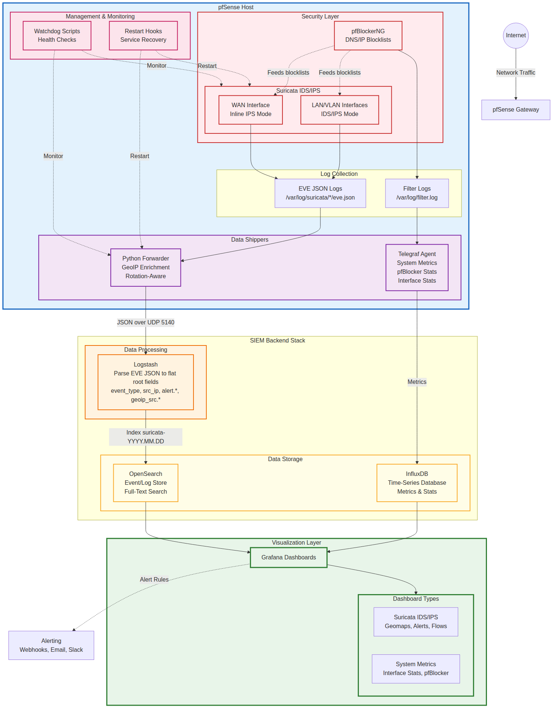

# pfSense SIEM Stack

> **A production pfSense monitoring stack, and the pfSense knowledge base that grew around it.**
> Suricata IDS/IPS, pfBlockerNG and Telegraf on pfSense feeding OpenSearch, Logstash and
> Grafana — with the tuning, hardening and upgrade notes learned from running it.

[](LICENSE)
[](https://www.pfsense.org/)
[](https://suricata.io/)
[](https://github.com/ChiefGyk3D/pfsense-siem-stack/actions/workflows/lint.yml)

This repository is two things, and you can use either without the other:

| | What you get | Start here |
|-|--------------|------------|
| **pfSense knowledge base** | How to run Suricata, pfBlockerNG and Telegraf well on pfSense: rule selection and SID tuning, blocklist strategy, east-west VLAN monitoring, traffic shaping, Telegraf plugins, the filterlog rotation bug, and **what breaks when you upgrade pfSense** | [docs/pfsense/](docs/DOCUMENTATION_INDEX.md#-pfsense-knowledge-base-no-siem-required) |
| **SIEM stack** | `setup.sh` wires pfSense into **any** OpenSearch + Grafana you already run (recommended: [siem-docker-stack](https://github.com/ChiefGyk3D/siem-docker-stack)): a rotation-aware GeoIP-enriching forwarder with watchdog, index templates, retention, and eight Grafana dashboards including three for Wazuh. `install.sh` builds a bare-metal server if you have none. | [Quick Start](QUICK_START.md) |


*Suricata IDS/IPS dashboard — WAN attack sources, signatures and geography*


*Per-interface dashboard — one repeating section per VLAN for east-west visibility*

---

## Status (September 2026)

| Component | State |
|-----------|-------|
| Suricata multi-interface forwarding (`scripts/forward-suricata-eve.py`) | ✅ Production — tested with 15 instances (2 WAN inline IPS + 13 VLAN IDS) on pfSense 2.8.1 |
| OpenSearch / Logstash pipeline, index templates, ISM retention | ✅ Production — **flat** root-level EVE fields ([Field Reference](docs/reference/FIELD_REFERENCE.md)) |
| Grafana dashboards: Suricata WAN, Suricata per-interface, pfSense system + pfBlockerNG, Windows exporter, Prometheus, Docker, 3× Wazuh | ✅ Shipped ([inventory](dashboards/README.md)) |
| `install.sh` bare-metal SIEM server (Ubuntu 24.04) | ✅ Works, now the **manual/single-box path**; **OpenSearch is unauthenticated by default** — see Security below. New server-side capability lands in siem-docker-stack first. |
| Releases | ✅ Tagged from `main` as `vX.Y.Z` (this overhaul is **2.0.0**); each tag publishes a tarball + `SHA256SUMS` on the [Releases page](https://github.com/ChiefGyk3D/pfsense-siem-stack/releases) |
| pfSense CE 2.9.0 | ⚠️ Supported with caveats — the Telegraf package is broken on 2.9.0 at release and the forwarder must be redeployed; read the [Upgrade Guide](docs/pfsense/PFSENSE_UPGRADE_GUIDE.md) first |
| Wazuh backend | ✅ Dashboards + deploy script ship here; the Wazuh server itself is provided by [siem-docker-stack](https://github.com/ChiefGyk3D/siem-docker-stack) |
| Graylog backend | ⏸️ Explored and shelved ([why](docs/siem/graylog/README.md)) |
| Alerting as code, TLS/queued transport, OpenSearch auth | 📝 Next — see [ROADMAP.md](ROADMAP.md) |

The strategic direction (see the roadmap) is for
[siem-docker-stack](https://github.com/ChiefGyk3D/siem-docker-stack) to be the
canonical server-side backend, and for this repo to own everything pfSense-side.

---

## Architecture



1. **pfSense** runs Suricata per interface (inline IPS on WAN, IDS on VLANs) behind pfBlockerNG.
2. **Forwarder** on pfSense tails every `/var/log/suricata/*/eve.json`, survives log rotation, adds `geoip_src`/`geoip_dest`, and ships JSON over UDP 5140.
3. **Logstash** parses to flat root-level fields and indexes into `suricata-YYYY.MM.DD`.
4. **Telegraf** on pfSense sends system metrics to InfluxDB and pfBlockerNG block/DNSBL logs straight to OpenSearch (`pfblockerng-*`).
5. **OpenSearch** stores events; **Grafana** visualises both datasources; optional Prometheus/Wazuh sources plug into the same Grafana.
6. **Reliability chain** on pfSense: rc.d service (boot) → cron watchdog every minute (crash) → `./setup.sh` again (after a pfSense upgrade).

| Component | Runs on | Purpose |
|-----------|---------|---------|
| Suricata, pfBlockerNG, Telegraf | pfSense | Detection, blocklists, metrics |
| `forward-suricata-eve.py` + rc.d + watchdog | pfSense | EVE shipping, GeoIP, self-healing |
| Logstash 8.x, OpenSearch 2.x, Grafana 12.x | SIEM server | Parse, store, visualise |
| InfluxDB, Prometheus (optional) | SIEM server | Time-series metrics |

---

## Quick start

Full walkthrough with prerequisites: [QUICK_START.md](QUICK_START.md). The short version:

```bash
git clone https://github.com/ChiefGyk3D/pfsense-siem-stack.git && cd pfsense-siem-stack
cp config.env.example config.env && nano config.env   # SIEM_HOST, PFSENSE_HOST, PFSENSE_USER
ssh-copy-id admin@<PFSENSE_IP>
./scripts/preflight.sh          # validates SSH, Python on pfSense, OpenSearch reachability
sudo ./install.sh               # ONLY if you have no OpenSearch/Grafana yet (bare-metal, single box)
./setup.sh                      # templates, Logstash pipeline, forwarder + rc.d + watchdog, dashboards, verification
./scripts/status.sh             # green ticks = data flowing
```

Or drive everything from the interactive console: `./pfsense-siem`
([docs](docs/operations/MANAGEMENT_CONSOLE.md)).

**Requirements in one line:** pfSense CE 2.7.2+ (2.8.1 tested, 2.9.0 see caveats) with
Suricata and SSH enabled; an Ubuntu 24.04 server with 16 GB RAM (32 GB recommended) and
100 GB+ SSD; SSH keys to both. Sizing detail and the "no SD cards" warning:
[Hardware Requirements](docs/install/HARDWARE_REQUIREMENTS.md).

### Recommended pfSense packages

| Package | Why | Used by |
|---------|-----|---------|
| **Suricata** | The IDS/IPS engine. Required. | Forwarder, Suricata dashboards |
| **pfBlockerNG-devel** | Blocks known-bad IPs/domains *before* Suricata sees them; GeoIP; the `-devel` branch gets features first | pfSense system dashboard (pfBlockerNG section) |
| **Telegraf** | System metrics → InfluxDB, pfBlockerNG logs → OpenSearch, and the exec plugins in `plugins/` | pfSense system dashboard |
| **ntopng** | Keeps a GeoLite2-City database updated on the box, which the forwarder reuses for the attack map | Forwarder GeoIP |
| **Cron** | Config.xml-backed cron jobs (filterlog auto-restart, optional durable watchdog) | Operations |
| **Service_Watchdog** | Restarts Suricata/Unbound/dpinger if they die | Reliability |
| **nut** | UPS monitoring (optional) | Telegraf |

Install order: pfBlockerNG-devel → Suricata → Telegraf → ntopng → Cron → Service_Watchdog.

---

## Documentation

**Hub: [docs/DOCUMENTATION_INDEX.md](docs/DOCUMENTATION_INDEX.md)** — organised by what you
are trying to do.

| Track | Directory | Highlights |
|-------|-----------|------------|
| pfSense knowledge base | [docs/pfsense/](docs/pfsense/) | [Suricata Optimization](docs/pfsense/SURICATA_OPTIMIZATION_GUIDE.md) ⭐ · [pfBlockerNG strategy](docs/pfsense/PFBLOCKERNG_OPTIMIZATION.md) and [feed reference](docs/pfsense/PFBLOCKERNG_FEED_REFERENCE.md) · [Telegraf on pfSense](docs/pfsense/TELEGRAF_ON_PFSENSE.md) · [LAN / east-west monitoring](docs/pfsense/LAN_MONITORING.md) · [Traffic shaping](docs/pfsense/TRAFFIC_SHAPING_GUIDE.md) · [**Upgrading pfSense**](docs/pfsense/PFSENSE_UPGRADE_GUIDE.md) |
| Deploy the SIEM | [docs/install/](docs/install/) | [Hardware](docs/install/HARDWARE_REQUIREMENTS.md) · [New user checklist](docs/install/NEW_USER_CHECKLIST.md) · SIEM server · forwarder · GeoIP · dashboards |
| Operate it | [docs/operations/](docs/operations/) | [Management console](docs/operations/MANAGEMENT_CONSOLE.md) · [Forwarder monitoring](docs/operations/SURICATA_FORWARDER_MONITORING.md) · [Retention](docs/operations/MULTI_INTERFACE_RETENTION.md) |
| Fix it | [docs/troubleshooting/](docs/troubleshooting/) | [Troubleshooting guide](docs/troubleshooting/TROUBLESHOOTING.md) · [Dashboard "No Data"](docs/troubleshooting/DASHBOARD_NO_DATA_FIX.md) 🔥 · [Data stops at midnight UTC](docs/troubleshooting/OPENSEARCH_AUTO_CREATE.md) · [Filterlog rotation bug](docs/troubleshooting/PFSENSE_FILTERLOG_ROTATION_FIX.md) |
| Reference | [docs/reference/](docs/reference/) | [Configuration](docs/reference/CONFIGURATION.md) · [Field reference](docs/reference/FIELD_REFERENCE.md) · [Scripts](scripts/README.md) · [Dashboards](dashboards/README.md) |
| Other backends | [docs/siem/](docs/siem/) | [Comparison](docs/siem/COMPARISON.md) · [Wazuh](docs/siem/wazuh/README.md) · [Graylog](docs/siem/graylog/README.md) |

Repository layout: [ORGANIZATION.md](ORGANIZATION.md). Superseded material is in git
history: [docs/ARCHIVE.md](docs/ARCHIVE.md).

---

## Security considerations

Be honest with yourself about what `install.sh` gives you today:

- **OpenSearch listens on `0.0.0.0:9200` with the security plugin disabled.** Anyone who
  can reach the port can read or delete your indices. Restrict 9200 to the Grafana host
  and your workstation with `ufw`, or bind it to a management interface; enabling the
  security plugin (auth + TLS) is the top item on the [roadmap](ROADMAP.md).
- **Suricata events travel as plain UDP** to Logstash on 5140. Restrict the port to the
  pfSense IP. A TLS/queued transport is planned.
- **Grafana ships with `admin`/`admin`** — change it on first login.
- **pfSense**: the scripts use key-based SSH as `admin`. Keep SSH restricted to your
  management network; pfSense 2.9.0 tightens sshd algorithms, so use an ed25519 key.
- **GeoIP and alert data** include client IPs; treat the SIEM server as sensitive.

### pfSense syslog for Wazuh

If you also forward pfSense syslog to a Wazuh-equipped
[siem-docker-stack](https://github.com/ChiefGyk3D/siem-docker-stack), set Status → System
Logs → Settings → Remote Logging to **RFC 5424** format with **RFC 3339** timestamps.
pfSense's default BSD format omits the hostname, Wazuh's pre-decoder then misreads the
program name as the host, and the built-in `pf` decoder never matches. Details in
[docs/siem/wazuh/README.md](docs/siem/wazuh/README.md).

---

## Contributing

Bug reports, dashboards, tuning notes and upgrade experiences are all welcome —
especially testing on pfSense 2.9.0, OpenSearch security enablement, and alert rules as
code. See [CONTRIBUTING.md](CONTRIBUTING.md); CI runs shell/JSON/Python syntax checks,
the forwarder unit tests and a documentation link check on every push.

## Related projects

| Repository | Role |
|------------|------|
| [siem-docker-stack](https://github.com/ChiefGyk3D/siem-docker-stack) | Dockerised SIEM/SOC backend: OpenSearch hot/warm, Logstash, Grafana, Wazuh, syslog-ng, n8n SOAR |
| [jumpcloud-wazuh-bridge](https://github.com/ChiefGyk3D/jumpcloud-wazuh-bridge) | JumpCloud identity events into Wazuh |
| [PiNodeXMR_Grafana_Dashboard](https://github.com/ChiefGyk3D/PiNodeXMR_Grafana_Dashboard) | Monero node monitoring in Grafana |
| [UniFi Poller](https://github.com/unpoller/unpoller) | **Not part of this project** — use it for UniFi switches/APs (with InfluxDB); this repo is pfSense-only |

## Acknowledgments

pfSense (Netgate and community), Suricata (OISF), OpenSearch, Grafana Labs, MaxMind
GeoLite2, Emerging Threats, Snort/Cisco Talos, abuse.ch, the UniFi Poller project for
telemetry patterns, and everyone who tested and reported.

## License

Mozilla Public License 2.0 — see [LICENSE](LICENSE).

## Support

- **Issues**: https://github.com/ChiefGyk3D/pfsense-siem-stack/issues
- **Discussions**: https://github.com/ChiefGyk3D/pfsense-siem-stack/discussions

---

## 💝 Donations and Tips

If you find this pfSense SIEM Stack useful, consider supporting development:

**Donate**:

<div align="center">
  <table>
    <tr>
      <td align="center"><a href="https://patreon.com/chiefgyk3d?utm_medium=unknown&utm_source=join_link&utm_campaign=creatorshare_creator&utm_content=copyLink" title="Patreon"></a></td>
      <td align="center"><a href="https://streamelements.com/chiefgyk3d/tip" title="StreamElements"></a></td>
    </tr>
    <tr>
      <td align="center">Patreon</td>
      <td align="center">StreamElements</td>
    </tr>
  </table>
</div>

### Cryptocurrency Tips

<div align="center">
  <table style="border:none;">
    <tr>
      <td align="center" style="padding:8px; min-width:120px;">
        
      </td>
      <td align="left" style="padding:8px;">
        <b>Bitcoin</b><br/>
        <code style="font-size:12px;">bc1qztdzcy2wyavj2tsuandu4p0tcklzttvdnzalla</code>
      </td>
    </tr>
    <tr>
      <td align="center" style="padding:8px; min-width:120px;">
        
      </td>
      <td align="left" style="padding:8px;">
        <b>Monero</b><br/>
        <code style="font-size:12px;">84Y34QubRwQYK2HNviezeH9r6aRcPvgWmKtDkN3EwiuVbp6sNLhm9ffRgs6BA9X1n9jY7wEN16ZEpiEngZbecXseUrW8SeQ</code>
      </td>
    </tr>
    <tr>
      <td align="center" style="padding:8px; min-width:120px;">
        
      </td>
      <td align="left" style="padding:8px;">
        <b>Ethereum</b><br/>
        <code style="font-size:12px;">0x554f18cfB684889c3A60219BDBE7b050C39335ED</code>
      </td>
    </tr>
  </table>
</div>

---

<div align="center">

Made with ❤️ by [ChiefGyk3D](https://github.com/ChiefGyk3D)

## Author & Socials

<table>
  <tr>
    <td align="center"><a href="https://social.chiefgyk3d.com/@chiefgyk3d" title="Mastodon"></a></td>
    <td align="center"><a href="https://bsky.app/profile/chiefgyk3d.com" title="Bluesky"></a></td>
    <td align="center"><a href="http://twitch.tv/chiefgyk3d" title="Twitch"></a></td>
    <td align="center"><a href="https://www.youtube.com/channel/UCvFY4KyqVBuYd7JAl3NRyiQ" title="YouTube"></a></td>
    <td align="center"><a href="https://kick.com/chiefgyk3d" title="Kick"></a></td>
    <td align="center"><a href="https://www.tiktok.com/@chiefgyk3d" title="TikTok"></a></td>
    <td align="center"><a href="https://discord.chiefgyk3d.com" title="Discord"></a></td>
    <td align="center"><a href="https://matrix-invite.chiefgyk3d.com" title="Matrix"></a></td>
  </tr>
  <tr>
    <td align="center">Mastodon</td>
    <td align="center">Bluesky</td>
    <td align="center">Twitch</td>
    <td align="center">YouTube</td>
    <td align="center">Kick</td>
    <td align="center">TikTok</td>
    <td align="center">Discord</td>
    <td align="center">Matrix</td>
  </tr>
</table>

</div>
