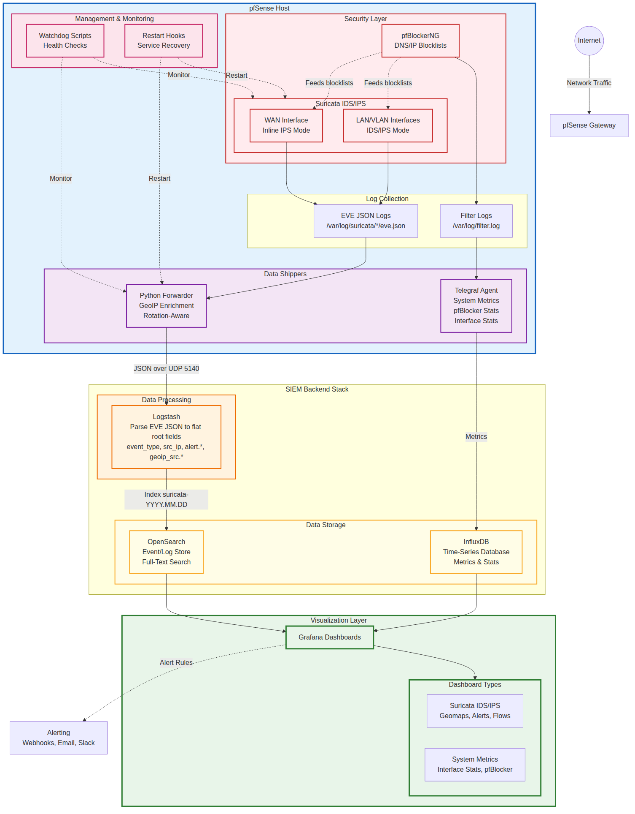

# pfSense SIEM Stack Wiki

> A production pfSense monitoring stack, and the pfSense knowledge base that grew around
> it. Everything here was written from a real, running deployment: pfSense with Suricata,
> pfBlockerNG and Telegraf feeding OpenSearch, Logstash and Grafana.

This wiki is generated from the Markdown files in the
[pfsense-siem-stack](https://github.com/ChiefGyk3D/pfsense-siem-stack) repository, so it
is always in step with the code. To fix or extend a page, edit the source file named at
the bottom of it and open a pull request. See [Contributing](../CONTRIBUTING.md).

## Pick your path

| You are... | Start with |
|------------|------------|
| **New to pfSense**, or new to running an IDS at home | [New to pfSense? Start Here](New-to-pfSense-Start-Here.md), then the [Glossary](Glossary.md) and [FAQ](FAQ.md) |
| Running pfSense and want **Suricata, pfBlockerNG or Telegraf to work well** (no SIEM needed) | [Suricata Optimization Guide](../docs/pfsense/SURICATA_OPTIMIZATION_GUIDE.md) · [pfBlockerNG Optimization](../docs/pfsense/PFBLOCKERNG_OPTIMIZATION.md) · [Telegraf on pfSense](../docs/pfsense/TELEGRAF_ON_PFSENSE.md) |
| About to **upgrade pfSense** (2.8.1 → 2.9.0) | [Upgrading pfSense](../docs/pfsense/PFSENSE_UPGRADE_GUIDE.md) |
| Ready to **ship Suricata events to a SIEM** and get the Grafana dashboards | [Quick Start](../QUICK_START.md) → [New User Checklist](../docs/install/NEW_USER_CHECKLIST.md) |
| Running the stack and **something broke** | [Troubleshooting](../docs/troubleshooting/TROUBLESHOOTING.md) · [Dashboard shows "No Data"](../docs/troubleshooting/DASHBOARD_NO_DATA_FIX.md) |
| Looking for **what a field, script or setting means** | [Field Reference](../docs/reference/FIELD_REFERENCE.md) · [Configuration Reference](../docs/reference/CONFIGURATION.md) · [Scripts Reference](../scripts/README.md) |

## The two halves of this project

**pfSense knowledge base.** Guides that apply to any pfSense CE 2.7+/2.8/2.9 box, whether
or not you ever forward a log anywhere: rule selection and SID tuning for Suricata,
blocklist strategy for pfBlockerNG, where Telegraf's configuration really lives,
east-west monitoring on VLANs, traffic shaping, the filterlog rotation bug, and what
breaks when you upgrade pfSense.

**SIEM stack.** A log forwarder that runs on pfSense, tails every Suricata `eve.json`,
survives log rotation, adds GeoIP, and ships JSON to Logstash over UDP. Plus index
templates, retention, and eight Grafana dashboards. `setup.sh` wires pfSense into any
OpenSearch + Grafana you already run; `install.sh` builds a single bare-metal server if
you have none.

## pfSense knowledge base

### Suricata (IDS/IPS)

- [Suricata Optimization Guide](../docs/pfsense/SURICATA_OPTIMIZATION_GUIDE.md) ⭐ — install, rule sources, IDS vs IPS, performance, log management, validation. Read this first.
- [Suricata Configuration and Design](../docs/pfsense/SURICATA_CONFIGURATION.md) — why Suricata over Snort, interface strategy, the SID tuning philosophy, common failure modes.
- [Suricata SID Management](../config/sid/README.md) — disable vs drop vs suppress, the maintainer's lists, how to build your own, how to apply them so they survive upgrades.
- [LAN and East-West Monitoring](../docs/pfsense/LAN_MONITORING.md) — IDS on internal VLANs to catch lateral movement.

### pfBlockerNG (blocklists and DNSBL)

- [pfBlockerNG Optimization](../docs/pfsense/PFBLOCKERNG_OPTIMIZATION.md) — strategy: which feeds matter, actions, update cadence, how it divides work with Suricata.
- [pfBlockerNG Feed Reference](../docs/pfsense/PFBLOCKERNG_FEED_REFERENCE.md) — the full feed catalog, whitelisting guide, privacy notes.

### Telegraf and metrics

- [Telegraf on pfSense](../docs/pfsense/TELEGRAF_ON_PFSENSE.md) — install, the Additional Configuration box, why it runs as root, restarting it correctly, the 2.9.0 breakage.
- [Telegraf Plugins](../plugins/README.md) — gateway status, temperature, Unbound and ARP vendor collectors shipped here.
- [MAC Vendor Lookup](../docs/pfsense/MAC_VENDOR_LOOKUP_SETUP.md) — manufacturer names for every device in the ARP table.
- [Telegraf pfBlockerNG Pipeline](../docs/pfsense/TELEGRAF_PFBLOCKER_SETUP.md) — pfBlockerNG block and DNSBL logs into OpenSearch.

### Platform

- [Upgrading pfSense](../docs/pfsense/PFSENSE_UPGRADE_GUIDE.md) ⭐ — general checklist, the 2.9.0 specifics, what survives and what does not.
- [Filterlog Stops After Rotation](../docs/troubleshooting/PFSENSE_FILTERLOG_ROTATION_FIX.md) — firewall and pfBlockerNG logging silently stopping, and the Cron job that fixes it.
- [Traffic Shaping Guide](../docs/pfsense/TRAFFIC_SHAPING_GUIDE.md) — limiters, CoDel and weighted queues for streaming, gaming and VoIP.
- [Shaping Optimization Notes](../docs/pfsense/SHAPING_OPTIMIZATION_NOTES.md) — measured lessons from a 1 Gbit/s cable line: what actually moved throughput and latency.
- [Hardware Requirements](../docs/install/HARDWARE_REQUIREMENTS.md) — sizing pfSense for IDS/IPS, and why SD cards will ruin your day.
- [CrowdSec (exploratory)](../docs/pfsense/crowdsec-phase1.md) — design notes, not part of the stack yet.

## SIEM stack

### Deploy

1. [Hardware Requirements](../docs/install/HARDWARE_REQUIREMENTS.md)
2. [Quick Start](../QUICK_START.md) and the [New User Checklist](../docs/install/NEW_USER_CHECKLIST.md)
3. [SIEM Server Installation](../docs/install/INSTALL_SIEM_STACK.md) — only if you have no OpenSearch + Grafana yet
4. [Forwarder Installation](../docs/install/INSTALL_PFSENSE_FORWARDER.md) — what `setup.sh` puts on pfSense
5. [GeoIP Setup](../docs/install/GEOIP_SETUP.md) — the attack map
6. [Dashboard Installation](../docs/install/INSTALL_DASHBOARD.md) and the [dashboard inventory](../dashboards/README.md)

### Operate

- [Management Console](../docs/operations/MANAGEMENT_CONSOLE.md) — the `pfsense-siem` menu
- [Forwarder Operations and Watchdog](../docs/operations/SURICATA_FORWARDER_MONITORING.md) — how the forwarder runs, day-2 commands, what survives reboot and upgrade
- [Multi-Interface and Retention](../docs/operations/MULTI_INTERFACE_RETENTION.md)
- [Scripts Reference](../scripts/README.md)

### Fix

- [Troubleshooting](../docs/troubleshooting/TROUBLESHOOTING.md) — the master runbook
- [Dashboard Shows "No Data"](../docs/troubleshooting/DASHBOARD_NO_DATA_FIX.md) 🔥
- [Data Stops at Midnight UTC](../docs/troubleshooting/OPENSEARCH_AUTO_CREATE.md)
- [Forwarder and Log Rotation](../docs/troubleshooting/LOG_ROTATION_FIX.md)

### Understand

- [Field Reference](../docs/reference/FIELD_REFERENCE.md) — what is stored, and why fields are flat
- [Configuration Reference](../docs/reference/CONFIGURATION.md) — every `config.env` variable and tuning knob
- [Configuration Files](../config/README.md) — the Logstash pipeline and index templates
- [SIEM Backend Comparison](../docs/siem/COMPARISON.md) · [Wazuh Integration](../docs/siem/wazuh/README.md) · [Graylog](../docs/siem/graylog/README.md)

## Project

[Project Overview](../README.md) · [Repository Layout](../ORGANIZATION.md) · [Roadmap](../ROADMAP.md) · [Changelog](../CHANGELOG.md) · [Contributing](../CONTRIBUTING.md) · [Archived Material](../docs/ARCHIVE.md)

Questions and discussion: [GitHub Discussions](https://github.com/ChiefGyk3D/pfsense-siem-stack/discussions).
Bugs: [GitHub Issues](https://github.com/ChiefGyk3D/pfsense-siem-stack/issues).
